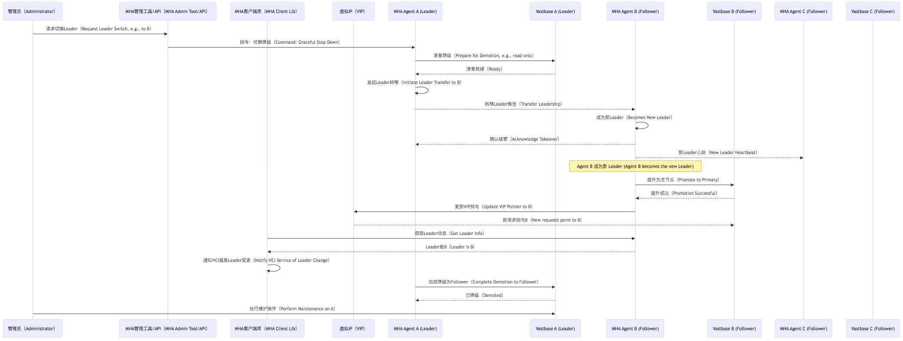

# mha4rdb 项目架构设计文档

## 1. 引言 (Introduction)

mha4rdb (Master High Availability for Relational Databases) 是一个旨在为关系型数据库提供高可用性解决方案的开源项目，初期重点支持Vastbase数据库。本项目主要面向存算x架构基础设施（基础设施 - Hyper-Converged Infrastructure）场景，解决其对配置信息持久化和一致性的核心需求。基础设施场景对数据一致性的要求极高，同时追求部署和管理的简单性。mha4rdb借鉴了现有成熟方案（如MHA4MySQL [3], Patroni [2], MySQL Group Replication [1]），并结合基础设施的特性，采用基于Raft一致性算法的分布式数据库集群和虚拟IP（VIP）漂移技术，提供一个简单、可靠、自动化的数据库高可用方案。

本文档详细阐述mha4rdb的总体架构设计、核心组件、模块交互、部署模型以及关键技术决策。

## 2. 设计原则 (Design Principles)

mha4rdb项目遵循以下核心设计原则：

* **分层与模块化设计 (Layered & Modular Design):** 清晰的层次结构，模块高内聚、低耦合，易于独立开发、测试和替换。
* **借鉴与创新 (Leverage & Innovate):** 吸收参考项目的优秀设计，并针对基础设施场景进行优化创新。
* **端到端价值导向 (End-to-End Value Orientation):** 设计直接映射到用户价值，通过清晰的技术语言阐述需求。
* **可测试性 (Testability):** 架构设计优先考虑单元测试、集成测试和端到端测试的便捷性。
* **可观测性 (Observability):** 内建统一的日志、指标和追踪机制。
* **可靠性与容错性 (Reliability & Fault Tolerance):** 完善的错误处理和故障恢复机制。
* **高性能与可伸缩性 (High Performance & Scalability):** 支持水平扩展和性能优化。
* **安全性 (Security):** 从设计之初就考虑安全因素。
* **代码质量与可维护性 (Code Quality & Maintainability):** 遵循Clean Code原则。

## 3. 系统架构 (System Architecture)

### 3.1. 核心组件 (Core Components)

mha4rdb系统主要由以下组件构成：

* **Vastbase 实例 (Vastbase Instance):** 数据库服务节点，负责数据的存储和管理，多个实例组成Raft集群。
* **MHA Agent:** 部署在每个Vastbase节点上的代理程序，负责监控本地数据库状态、参与Raft集群管理、执行故障切换逻辑，并与基础设施服务通信。
* **仲裁服务 (Quorum/Witness Service - Arbiter):** （可选）在双机部署时引入，防止脑裂。在三节点及以上Raft集群中，其功能由Raft协议自身保证。
* **虚拟IP (Virtual IP - VIP):** 对基础设施服务提供统一的数据库访问入口，自动漂移到当前的Leader节点。
* **基础设施 服务 (基础设施 Service):** 存算x架构基础设施的控制平面，依赖mha4rdb进行配置数据的持久化。
* **MHA Client Library:** 集成在基础设施服务中的Go语言库，负责与MHA Agent集群进行通信，获取集群状态、Leader信息等。

### 3.2. 架构图 (Architecture Diagram)

下图展示了mha4rdb的整体架构和主要组件间的交互关系。

该架构图中，基础设施服务通过MHA客户端库与MHA Agent集群进行通信，获取当前Leader信息，并通过虚拟IP连接到Leader数据库实例。MHA Agent之间通过Raft协议（或其封装）保证一致性，并监控各自的Vastbase实例。

### 3.3. 部署模型 (Deployment Models)

mha4rdb支持灵活的部署模式以适应不同的基础设施环境需求：

  * **单机模式 (Single Node Mode):**

      * 组成：1个Vastbase实例 + 1个MHA Agent。
      * 说明：Agent主要负责本地健康检查和状态上报，无HA能力。
      * 适用场景：开发测试环境或对可用性要求极低的场景。

  * **双机+仲裁模式 (Dual Node + Arbiter Mode):**

      * 组成：2个Vastbase实例 + 2个MHA Agent + 1个独立的仲裁服务。
      * 说明：通过Raft协议（最小三节点，仲裁节点作为其中一员但不存储数据）选举Leader，避免脑裂。
      * 适用场景：对成本敏感但需要基本HA能力的场景。

  * **多机集群模式 (Multi-Node Cluster Mode):**

      * 组成：3个或更多Vastbase实例 + 对应数量的MHA Agent。
      * 说明：标准的Raft集群，提供高可用性和数据一致性。推荐至少三节点。
      * 适用场景：生产环境，对高可用性和数据可靠性有较高要求的场景。

### 3.4. 部署图 (Deployment Diagram - Multi-Node Example)

下图展示了一个典型的三节点mha4rdb集群部署。

在此部署图中，基础设施服务通过其集成的MHA客户端库与MHA Agent集群通信。虚拟IP（VIP）始终指向Raft集群的Leader节点（例如Vastbase实例A）。每个MHA Agent负责监控其本地Vastbase实例，并参与Raft集群的共识过程。

## 4\. 模块设计 (Module Design)

### 4.1. MHA Agent

MHA Agent是部署在每个数据库节点上的核心组件，其主要职责包括：

  * **本地数据库监控 (Local DB Monitoring):** 周期性检查本地Vastbase实例的健康状态、复制状态等。
  * **Raft集群参与 (Raft Cluster Participation):**
      * 作为Raft集群的一员，参与Leader选举、日志复制（针对Agent自身状态或代理Vastbase的Raft操作）。
      * 如果Vastbase自身不直接集成Raft，Agent将协调Vastbase的数据复制使其行为符合Raft语义。
  * **故障检测与切换 (Failure Detection & Switchover):** 检测Leader故障，触发新的Leader选举，并协调VIP的漂移。
  * **API服务 (API Service):** 提供gRPC接口供MHA Client查询状态、获取Leader信息，以及（有限的）管理操作。
  * **配置管理 (Configuration Management):** 管理本地Agent及相关数据库连接的配置。
  * **状态上报 (Status Reporting):** 向基础设施服务（通过MHA Client）上报数据库集群的健康状态和拓扑信息。

### 4.2. MHA Client Library

MHA Client Library是一个嵌入到基础设施服务中的Go语言库，其功能：

  * **服务发现 (Service Discovery):** 发现MHA Agent集群中的节点。
  * **Leader查询 (Leader Query):** 获取当前数据库集群的Leader节点信息（IP、端口）。
  * **状态订阅 (Status Subscription):** 订阅数据库集群的状态变更事件（如Leader切换、节点增删）。
  * **故障处理回调 (Failure Handling Callback):** 当检测到数据库Leader切换时，通知基础设施服务更新其连接配置。
  * **API封装 (API Abstraction):** 封装与MHA Agent的gRPC通信细节。

### 4.3. Vastbase MHA 接口 (Vastbase MHA Interface)

为了与MHA Agent良好集成，Vastbase数据库需要提供或标准化以下接口/功能：

  * **Raft协议实现或集成 (Raft Protocol Implementation/Integration):** 核心要求，包括Leader选举、日志复制、成员变更等。可以直接集成如`etcd/raft`库。
  * **状态监控接口 (Status Monitoring Interface):** 提供SQL接口或API，供MHA Agent查询：
      * 数据库运行状态（如 `primary`, `standby`, `recovery`）。
      * Raft集群成员信息、Leader状态、任期号、日志同步位点。
      * 复制延迟等关键指标。
  * **节点管理接口 (Node Management Interface):** 安全地执行集群管理操作，如：
      * 提升为Leader (Promote to Leader)。
      * 降级为Follower (Demote to Follower)。
      * 优雅地加入/离开集群 (Graceful Join/Leave Cluster)。
      * 同步数据 (Synchronize Data)。
  * **日志同步和恢复机制 (Log Sync & Recovery):** 确保节点故障恢复后能快速与集群同步数据。
  * **可观测性 (Observability):** 提供丰富的监控指标（Metrics）和详细的日志，便于故障诊断。

### 4.4. 虚拟IP管理 (VIP Management)

VIP管理是实现服务接入高可用的关键。

  * **机制 (Mechanism):** 通常通过ARP欺骗（ARP spoofing）、路由宣告或专用的VIP管理工具（如Keepalived的VRRP协议，或云平台的VIP服务）实现。
  * **触发 (Trigger):** 当MHA Agent集群选举出新的Leader后，由新Leader节点的MHA Agent或一个专门的协调者负责将VIP漂移到新Leader所在的物理机网络接口上。
  * **集成 (Integration):** 基础设施服务需要能够配置VIP地址。MHA Agent需要权限执行VIP漂移操作，或调用外部脚本/API完成。

## 5\. 接口定义 (Interface Definitions)

系统各组件间的交互依赖于明确定义的接口。主要的Go语言接口将在代码层面详细定义，包括：

  * **`MHA_Client_Interface` (基础设施 Software \<-\> MHA Client Lib):** 基础设施服务调用MHA Client库的接口。
      * 例如：`GetLeader() (NodeInfo, error)`, `GetClusterStatus() (ClusterStatus, error)`, `RegisterChangeListener(listener StatusChangeListener)`
  * **`MHA_Agent_Interface` (MHA Client Lib \<-\> MHA Agent):** MHA Client库与MHA Agent（通常是gRPC）的通信接口。
      * 例如：`ReportStatus(NodeStatusInfo) error`, `GetNodeState() (NodeState, error)` (gRPC service methods)
  * **`Vastbase_MHA_Interface` (MHA Agent \<-\> Vastbase DB):** MHA Agent与Vastbase数据库交互的接口。
      * 例如：`GetRole() (DBRole, error)`, `IsHealthy() bool`, `PromoteToLeader() error`, `GetRaftStatus() (RaftInfo, error)`
  * **`Raft_Interface` (MHA Agent internal or Vastbase internal):** Raft协议的核心接口。
      * 例如：`Propose(data []byte) error`, `GetLeaderID() uint64`, `AddNode(nodeID uint64, addr string) error`

这些接口的具体方法签名将在后续代码实现中详细定义，确保模块间的解耦和可测试性。

## 6\. 核心流程 (Core Flows)

### 6.1. Leader节点故障切换 (Leader Node Failure Switchover)

以三节点集群（Node A - Leader, Node B - Follower, Node C - Follower）为例：

**流程说明:**

1.  基础设施服务通过VIP将数据库请求路由到当前的Leader节点（DB\_A）。
2.  DB\_A发生故障，其关联的MHA Agent A也可能受影响或检测到故障。
3.  其他Follower节点的Agent（B和C）通过心跳机制检测到Leader A失联。
4.  Agent B和C中的一个（或多个）发起Raft Leader选举。
5.  假设Agent B赢得选举，成为新的Leader Agent。
6.  Agent B协调将其关联的Vastbase实例DB\_B提升为Primary。
7.  Agent B（或协调机制）更新VIP，使其指向DB\_B。
8.  MHA Client Library检测到Leader变更（通过轮询或Agent的主动通知），并通知基础设施服务。
9.  基础设施服务更新其数据库连接信息，后续请求通过VIP路由到新的Leader DB\_B。

### 6.2. 维护Leader节点（手动切换）(Planned Maintenance of Leader Node)

以三节点集群（Node A - Leader, Node B - Follower, Node C - Follower）为例，计划维护Node A：

**流程说明:**

1.  管理员通过MHA管理工具发起Leader切换请求，指定新Leader（或让Raft自动选择）。
2.  管理工具向当前Leader Agent A（或目标Agent B）发送指令。
3.  Agent A（如果收到降级指令）会准备其Vastbase实例DB\_A进行降级（例如，确保所有事务提交，切换到只读）。
4.  Agent A触发Raft的Leader转移流程（如果Raft实现支持）或主动辞职，让其他节点（如B）选举成为新Leader。
5.  Agent B成为新Leader后，将其Vastbase实例DB\_B提升为Primary。
6.  Agent B更新VIP指向DB\_B。
7.  MHA Client Library感知到Leader变化并通知基础设施服务。
8.  原Leader DB\_A完成降级，可以进行维护。

## 7\. 数据一致性 (Data Consistency)

数据一致性是mha4rdb的核心保障。

  * **Raft协议 (Raft Protocol):** 系统强依赖Raft一致性算法。Vastbase本身需要实现Raft，或者MHA Agent能够代理并强制Vastbase的复制行为遵循Raft语义（后者更为复杂和风险较高，推荐Vastbase原生支持）。
  * **日志复制 (Log Replication):** Leader将其操作日志（Write-Ahead Log - WAL或等效Raft日志条目）复制到多数Follower节点，并在多数节点确认后才将操作标记为已提交，并应用到状态机（数据库）。
  * **Leader选举 (Leader Election):** 只有拥有最新已提交日志的节点才能当选为Leader，保证了数据不会回滚到旧状态。
  * **成员变更 (Membership Changes):** Raft协议支持安全的集群成员变更（增删节点），确保过程中集群的可用性和数据一致性。
  * **读一致性 (Read Consistency):**
      * 默认情况下，所有读请求都发送给Leader，保证强一致性（读到最新已提交数据）。
      * 可考虑支持Follower读（需要基础设施 Client配合），但这可能导致读取到轻微过时的数据（最终一致性），适用于对一致性要求稍低的读场景。

## 8\. DFX 考虑 (DFX Considerations)

### 8.1. 性能 (Performance)

  * **Raft优化 (Raft Optimization):** 采用批量提交、流水线复制等优化手段减少Raft协议的延迟。
  * **读写分离 (Read/Write Splitting):** Leader处理写请求和强一致性读，Follower可处理弱一致性读请求。MHA Client需要支持此路由。
  * **连接池 (Connection Pooling):** 在MHA Client和MHA Agent中高效管理数据库连接。
  * **异步处理 (Asynchronous Processing):** Agent内部对于非关键路径的操作（如状态上报）可采用异步方式。

### 8.2. 可靠性 (Reliability)

  * **Quorum机制 (Quorum Mechanism):** 严格遵守Raft的Quorum（多数派）原则进行选举和日志提交。
  * **自动故障恢复 (Automatic Fault Recovery):** Agent应能处理临时性故障，并尝试自动恢复。
  * **数据校验 (Data Validation):** 可选的后台数据校验机制，确保各副本间数据一致性。
  * **备份与恢复 (Backup & Restore):** 提供与备份恢复方案集成的钩子或指导。
  * **网络分区容忍 (Network Partition Tolerance):** Raft保证在网络分区发生时，只有一个分区（多数派分区）能选举出Leader并继续服务，防止脑裂。

### 8.3. 可测试性 (Testability)

  * **单元测试 (Unit Testing):** 对各模块（Agent、Client、Raft封装等）进行充分的单元测试。
  * **集成测试 (Integration Testing):** 模拟节点故障、网络分区、Leader切换等场景。
  * **故障注入 (Fault Injection):** 引入故障注入框架，测试系统的鲁棒性。
  * **Mock与Stub (Mocks & Stubs):** 大量使用接口，方便对依赖组件（如数据库、网络）进行Mock。

### 8.4. 可观测性 (Observability)

  * **结构化日志 (Structured Logging):** 所有组件输出结构化的日志，方便采集和分析。统一的日志对象`logger`。
  * **指标监控 (Metrics Monitoring):** 暴露关键性能指标（Prometheus格式），如Raft选举次数、日志复制延迟、Leader切换耗时、数据库连接数、API请求延迟等。
  * **分布式追踪 (Distributed Tracing):** （可选）为关键路径（如一次写请求到多副本提交）引入分布式追踪。

## 9\. 基础设施 与 Vastbase 改造 (基础设施 and Vastbase Modifications)

### 9.1. 基础设施 自身业务需要改造的部分 (基础设施 Service Modifications)

  * **MHA Client 集成 (MHA Client Integration):** 集成MHA Client库，调用其API。
  * **VIP 管理适配 (VIP Management Adaptation):** 基础设施服务可能需要配置和感知VIP。
  * **故障处理逻辑 (Failure Handling Logic):** 实现Leader切换时的连接重定向。
  * **健康检查集成 (Health Check Integration):** 利用MHA Client获取数据库健康状态。
  * **配置管理 (Configuration Management):** 动态处理数据库集群地址变化。

### 9.2. 海量数据库Vastbase需要标准化的MHA功能 (Vastbase MHA Standardization)

  * **Raft协议实现或集成 (Raft Protocol Implementation/Integration):** 这是最核心的改造。
  * **状态监控接口 (Status Monitoring Interface):** 标准SQL或API接口。
  * **节点管理接口 (Node Management Interface):** 安全的集群操作接口。
  * **日志同步和恢复机制 (Log Sync and Recovery):** 高效可靠。
  * **可观测性 (Observability):** 丰富的Metrics和日志。

## 10\. 未来展望 (Future Outlook)

  * **支持更多数据库 (Support for More Databases):** 将核心MHA逻辑抽象，通过插件或适配器支持其他关系型数据库（MySQL, PostgreSQL, OpenGaussDB）。
  * **更智能的负载均衡 (Smarter Load Balancing):** 基于节点负载和健康状况的读请求路由。
  * **自动化运维增强 (Enhanced Automated Operations):** 如自动扩缩容、自动数据均衡等。
  * **云原生集成 (Cloud-Native Integration):** 更好地与Kubernetes等容器编排平台集成，例如通过Operator模式。

## 11\. 参考资料 (References)

- [1] MySQL Group Replication: https://dev.mysql.com/doc/refman/8.0/en/group-replication.html
- [2] PostgreSQL Patroni: https://patroni.readthedocs.io/en/latest/
- [3] [Development tree of Master High Availability Manager and tools for MySQL (MHA), Manager part](https://github.com/yoshinorim/mha4mysql-manager)
- [4] [Development tree of Master High Availability Manager and tools for MySQL (MHA), Node (MySQL Server) part](https://github.com/yoshinorim/mha4mysql-node)
