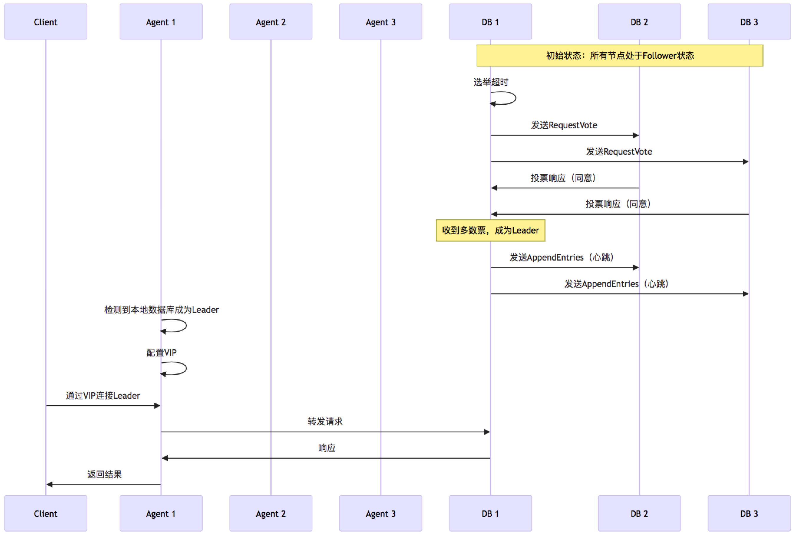
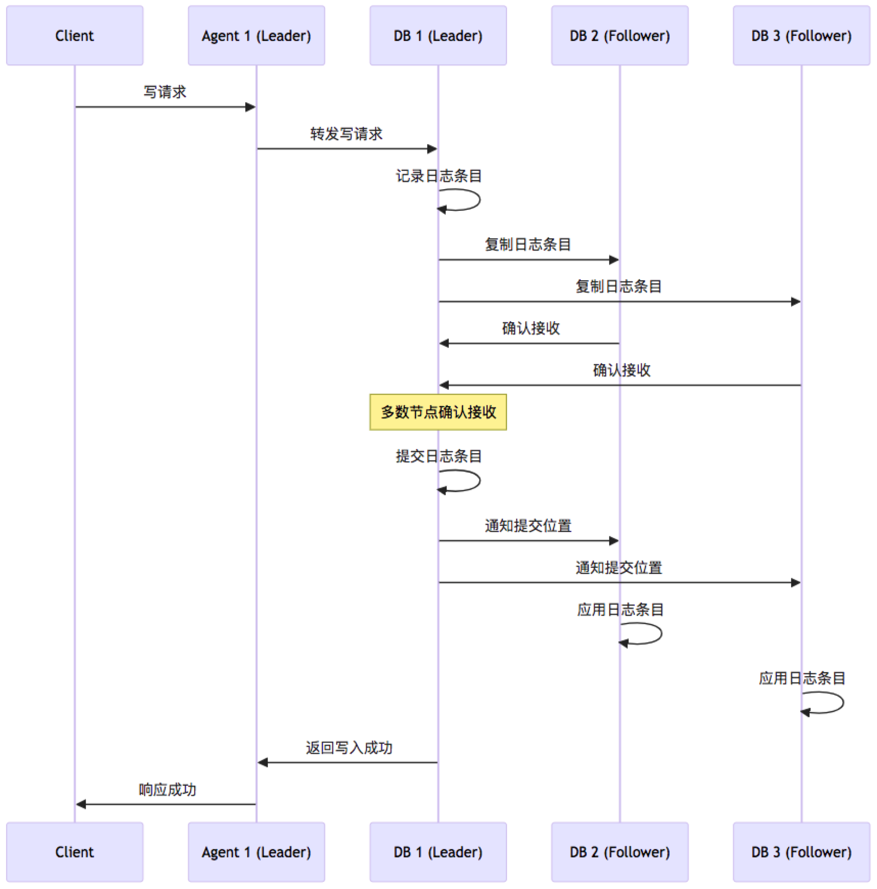
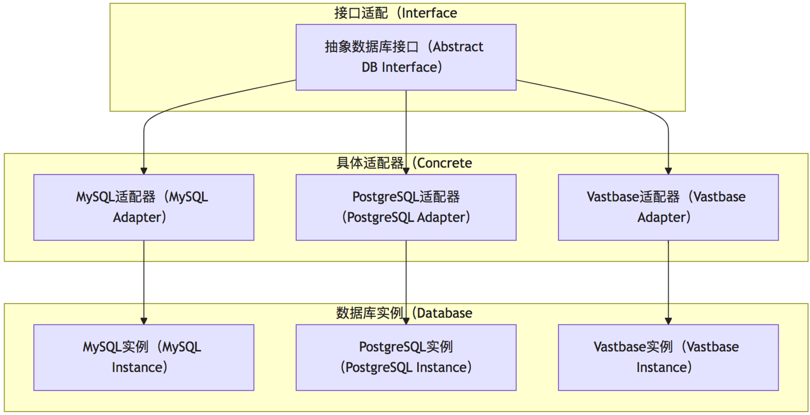
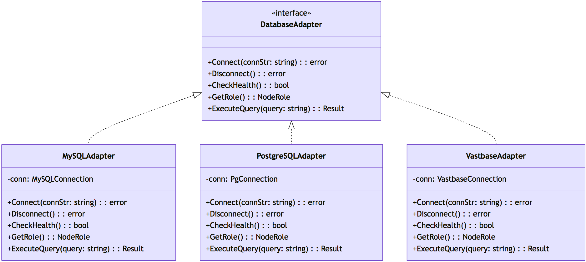
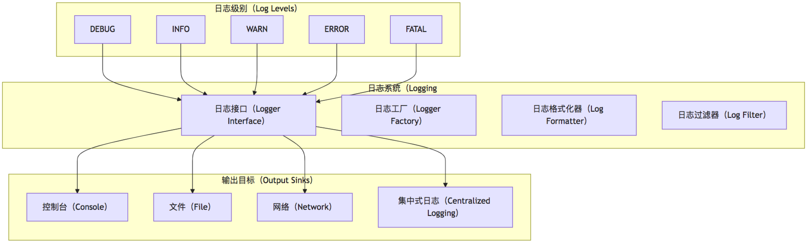
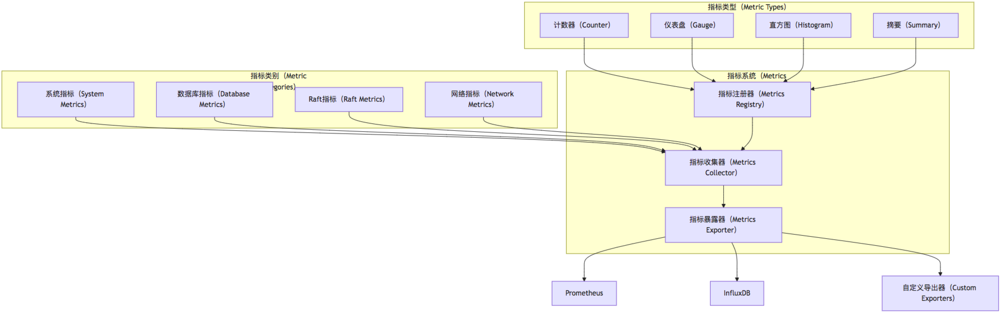
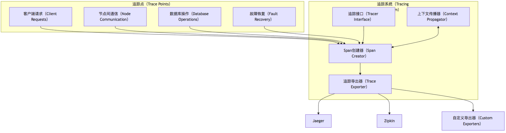
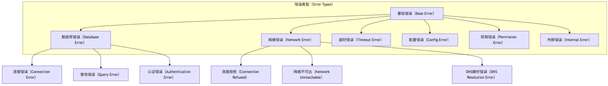

# mha4rdb 项目详细设计文档

## 1. 项目概述

mha4rdb（Master High Availability for Relational Database）是一个基于Go语言的开源项目，旨在为关系型数据库（如MySQL、PostgreSQL、OpenGaussDB和Vastbase等）提供高可用性管理解决方案。该项目借鉴了MySQL MHA、PostgreSQL Patroni等成熟开源项目的设计理念，同时结合了Raft一致性算法，为HCI（超融合基础设施）场景下的数据库集群提供了简单、可靠、自动化的高可用性管理工具。

### 1.1 设计背景与目标

在HCI场景中，配置信息的事务性持久化和一致性至关重要。与通用OLTP数据库相比，HCI场景对数据一致性的要求更高，而对极致读写性能的要求相对较低。mha4rdb项目针对这一特点，设计了从单机部署到多机集群的演进路径，并通过Raft一致性算法保证数据的高可用和一致性。

### 1.2 核心功能

- 支持多种部署模式：单机、双机+仲裁、多机集群
- 基于Raft算法的一致性保证
- 自动故障检测与恢复
- 自动Leader选举与切换
- 虚拟IP（VIP）管理，提供统一访问入口
- 与HCI服务的良好集成
- 全面的监控与告警机制

## 2. 系统架构

mha4rdb采用分层架构设计，将系统分为多个独立但相互协作的组件。这种设计使得系统具有高度的模块化和可扩展性，同时也便于测试和维护。

### 2.1 整体架构图


上图展示了mha4rdb的整体架构。HCI服务通过MHA客户端与MHA集群交互，MHA集群由多个MHA代理和可选的仲裁服务组成。MHA代理负责监控和管理各自的数据库实例，并通过Raft协议实现Leader选举和一致性。虚拟IP（VIP）为HCI服务提供了统一的访问入口，始终指向当前的Leader节点。

### 2.2 部署架构图

根据不同的部署场景，mha4rdb支持多种部署模式：


上图展示了mha4rdb的三种部署模式：
1. 单机部署：简单但存在单点故障的风险
2. 双机+仲裁部署：通过引入仲裁服务避免脑裂问题
3. 多机集群部署：提供更高的可用性和扩展性

### 2.3 分层架构设计


上图展示了mha4rdb的分层架构设计：
1. 接口层：提供API接口和命令行工具，与用户或外部系统交互
2. 应用层：实现业务逻辑，包括集群管理、健康检查、故障转移、恢复和VIP管理等服务
3. 领域层：包含系统的核心领域逻辑，如Raft共识、集群健康、状态管理和Leader选举等
4. 基础设施层：提供底层支持，包括数据库适配器、网络管理、存储、日志和监控指标等

## 3. 核心组件

### 3.1 MHA Agent

MHA Agent是mha4rdb的核心组件，部署在每个数据库节点上，负责监控和管理本地数据库实例，以及参与Raft集群的选举和管理。


MHA Agent的核心模块包括：
1. Raft模块：实现Raft一致性算法，负责Leader选举和日志复制
2. 健康监控模块：监控本地数据库实例的健康状态
3. 状态管理模块：管理Agent和数据库的状态信息
4. 故障转移模块：在故障发生时执行故障转移操作

### 3.2 MHA Client

MHA Client是HCI服务集成的客户端库，提供与MHA集群交互的接口。


MHA Client的核心模块包括：
1. 连接发现：发现并连接到MHA集群，获取Leader节点信息
2. 状态监控：监控MHA集群的状态
3. 事件处理：处理集群状态变化事件，如Leader切换

### 3.3 仲裁服务（Arbiter）

在双机部署场景下，仲裁服务是避免脑裂问题的关键组件。


仲裁服务的核心模块包括：
1. 投票服务：接收并处理Agent的投票请求
2. 状态监控：监控集群的整体状态
3. 健康检查：检查自身和Agent的健康状态

### 3.4 虚拟IP管理

虚拟IP（VIP）是为HCI服务提供统一访问入口的关键组件。


VIP管理的核心模块包括：
1. VIP分配服务：将VIP分配给当前的Leader节点
2. VIP监控服务：监控VIP的状态和可达性
3. VIP切换服务：在Leader切换时迁移VIP

### 3.5 Raft协议实现

系统基于Raft共识算法实现数据一致性和Leader选举。

#### 主要功能：

- Leader选举
- 日志复制
- 成员管理
- 状态一致性保证
- 快照与日志压缩

## 4. 核心流程

### 4.1 启动流程


上图展示了mha4rdb的启动流程，包括初始化连接、健康检查、Raft选举、VIP配置、HCI连接和MHA Client初始化等步骤。

### 4.2 故障检测与恢复流程


上图展示了mha4rdb的故障检测与恢复流程，包括故障检测、Raft重新选举、VIP迁移、HCI重新连接和故障恢复等步骤。

### 4.3 手动切换流程


上图展示了mha4rdb的手动切换流程，包括发起手动切换、预检查、准备切换、执行切换、角色切换、VIP迁移和完成切换等步骤。

### 4.4 Leader选举流程



### 4.5 数据同步流程



### 4.6 数据库适配流程



## 5. 关键组件详细设计

### 5.1 数据结构与接口定义

#### 5.1.1 节点状态定义

```go
// NodeStatus 节点状态枚举
type NodeStatus int

const (
    // 节点状态：未知
    NodeStatusUnknown NodeStatus = iota
    // 节点状态：在线
    NodeStatusOnline
    // 节点状态：离线
    NodeStatusOffline
    // 节点状态：故障
    NodeStatusFault
    // 节点状态：维护中
    NodeStatusMaintaining
)
```

#### 5.1.2 节点角色定义

```go
// NodeRole 节点角色枚举
type NodeRole int

const (
    // 节点角色：未知
    NodeRoleUnknown NodeRole = iota
    // 节点角色：Leader
    NodeRoleLeader
    // 节点角色：Follower
    NodeRoleFollower
    // 节点角色：Candidate
    NodeRoleCandidate
    // 节点角色：Arbiter（仲裁者）
    NodeRoleArbiter
)
```

#### 5.1.3 数据库接口定义

```go
// DatabaseAPI 数据库操作接口
type DatabaseAPI interface {
    // Connect 连接数据库
    Connect(ctx context.Context, connStr string) error
    // Disconnect 断开连接
    Disconnect(ctx context.Context) error
    // CheckHealth 检查健康状态
    CheckHealth(ctx context.Context) (bool, error)
    // GetStatus 获取数据库状态
    GetStatus(ctx context.Context) (*DBStatus, error)
    // ExecuteCommand 执行命令
    ExecuteCommand(ctx context.Context, command string) (interface{}, error)
    // Backup 备份数据库
    Backup(ctx context.Context, options *BackupOptions) error
    // Restore 恢复数据库
    Restore(ctx context.Context, backupPath string) error
}
```

#### 5.1.4 MHA Agent接口定义

```go
// AgentAPI MHA Agent操作接口
type AgentAPI interface {
    // Start 启动Agent服务
    Start() error
    // Stop 停止Agent服务
    Stop() error
    // GetStatus 获取Agent状态
    GetStatus() (*AgentStatus, error)
    // MonitorDB 监控数据库
    MonitorDB() error
    // ConfigureVIP 配置虚拟IP
    ConfigureVIP(vip string, netInterface string) error
    // RemoveVIP 移除虚拟IP
    RemoveVIP() error
    // JoinCluster 加入集群
    JoinCluster(managerAddr string, nodeID string) error
    // LeaveCluster 离开集群
    LeaveCluster() error
}
```

#### 5.1.5 MHA Manager接口定义

```go
// ManagerAPI MHA Manager操作接口
type ManagerAPI interface {
    // Start 启动Manager服务
    Start() error
    // Stop 停止Manager服务
    Stop() error
    // GetClusterStatus 获取集群状态
    GetClusterStatus() (*ClusterStatus, error)
    // AddNode 添加节点
    AddNode(nodeInfo *NodeInfo) error
    // RemoveNode 移除节点
    RemoveNode(nodeID string) error
    // SetNodeMaintenance 设置节点维护模式
    SetNodeMaintenance(nodeID string, maintenance bool) error
    // SwitchLeader 切换Leader
    SwitchLeader(targetNodeID string) error
    // GetLeader 获取当前Leader
    GetLeader() (*NodeInfo, error)
    // RegisterEventHandler 注册事件处理器
    RegisterEventHandler(eventType EventType, handler EventHandler) error
}
```

### 5.2 具体实现设计

#### 5.2.1 Raft协议实现

MHA4RDB将利用第三方Raft实现（如etcd/raft），并进行必要的封装和扩展。主要组件包括：

- **RaftNode**：Raft节点实现，包括状态机、日志存储和网络传输
- **RaftStorage**：Raft日志和快照存储
- **RaftTransport**：节点间通信实现
- **RaftStateMachine**：状态机实现，处理Raft日志条目

#### 5.2.2 VIP管理实现

VIP管理模块负责处理虚拟IP的配置和切换，主要组件包括：

- **VIPController**：控制VIP的分配和迁移
- **NetworkInterface**：网络接口操作抽象
- **IPAddrManager**：IP地址管理
- **ARP**：ARP报文处理

#### 5.2.3 故障检测实现

故障检测模块负责检测节点和服务的故障，主要组件包括：

- **HealthChecker**：健康检查器，定期检查节点和服务状态
- **FaultDetector**：故障检测器，分析健康检查结果
- **FaultHandler**：故障处理器，执行故障恢复操作
- **HeartbeatMonitor**：心跳监控，监控节点活跃状态

## 6. 数据库适配设计

MHA4RDB设计为支持多种关系型数据库，通过适配器模式实现对不同数据库的统一管理。

### 6.1 适配器架构



### 6.2 数据库特定实现

每种数据库都有特定的实现，包括：

- 连接管理
- 状态检查
- 角色识别
- 命令执行
- 故障处理

## 7. 可观测性设计

MHA4RDB内置完善的可观测性功能，包括日志、指标和追踪。

### 7.1 日志系统

系统采用结构化日志，支持不同级别的日志输出和多种输出目标。



### 7.2 指标系统

系统收集各种性能和状态指标，支持Prometheus等监控系统。



### 7.3 追踪系统

系统支持分布式追踪，便于排查跨组件的问题。



## 8. 错误处理设计

MHA4RDB采用统一的错误处理机制，包括错误类型定义、错误传播和错误恢复。

### 8.1 错误类型体系



### 8.2 错误处理策略

MHA4RDB针对不同类型的错误采用不同的处理策略：

- **重试策略**：对于可恢复的暂时性错误（如网络波动）
- **降级策略**：在部分功能不可用时继续提供核心服务
- **隔离策略**：将故障组件隔离，防止故障扩散
- **恢复策略**：针对各种故障场景的自动恢复机制
