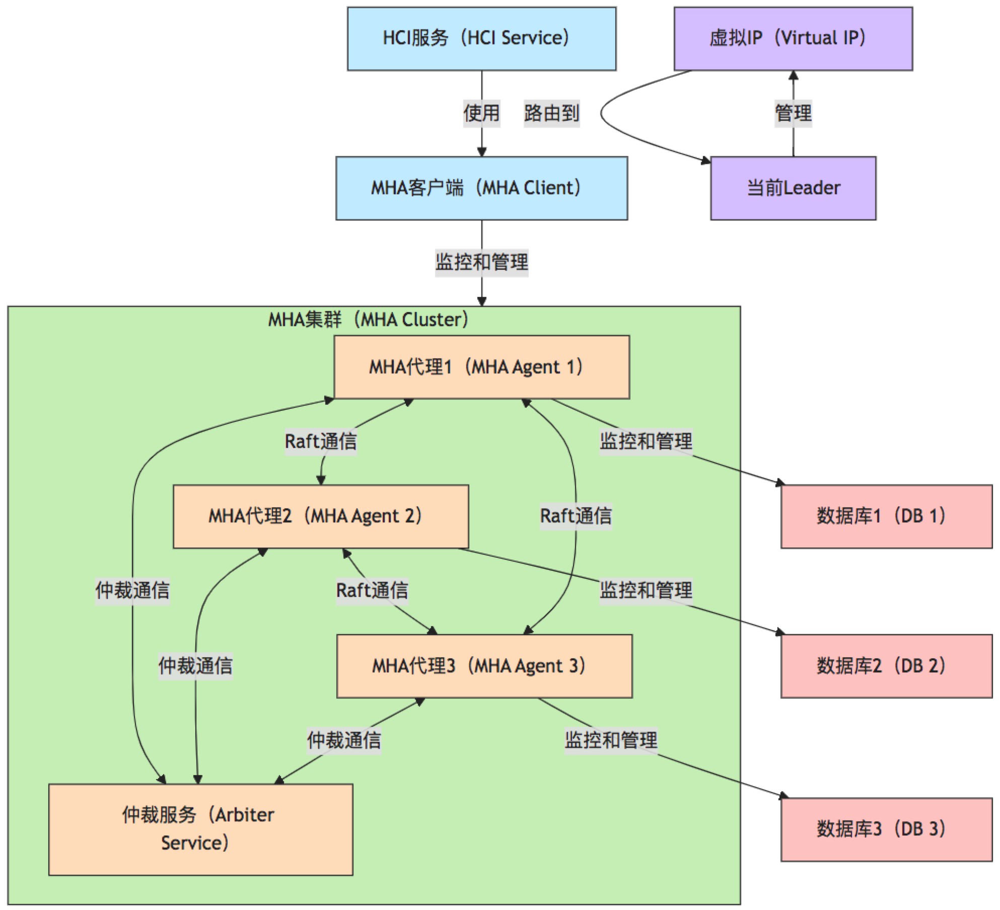
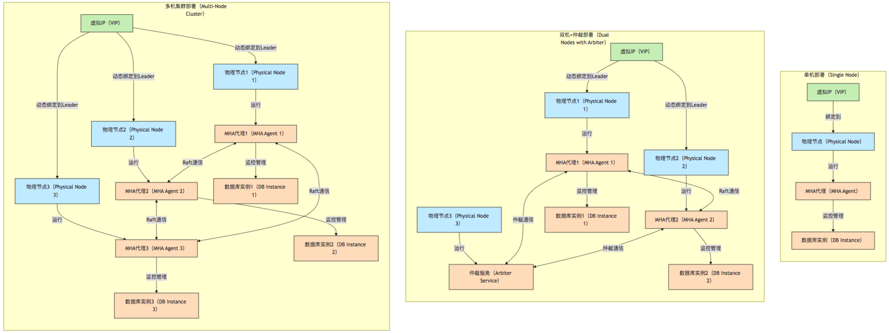
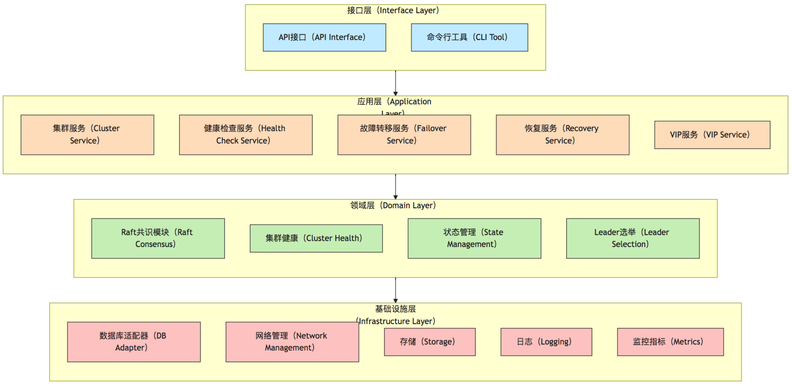
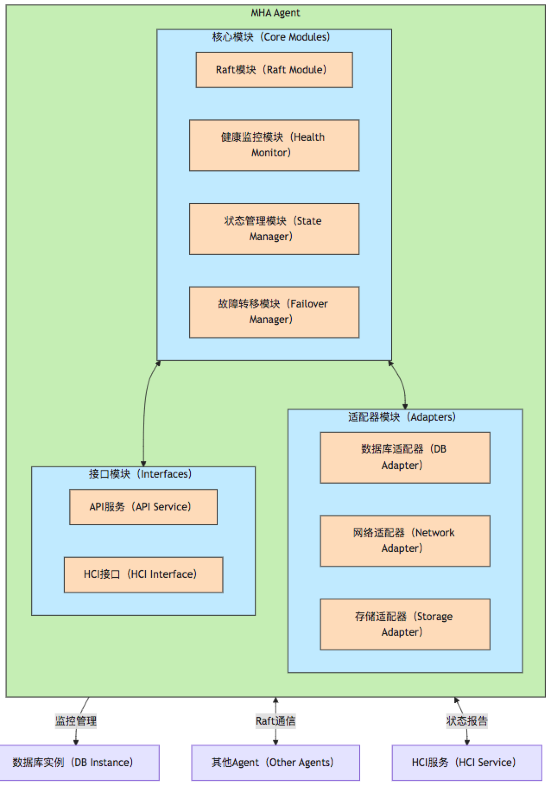
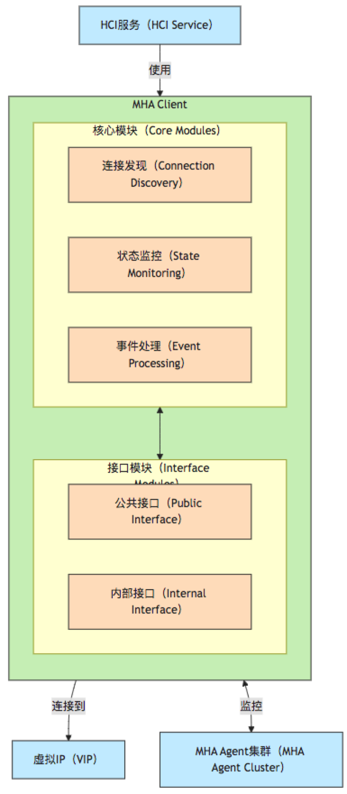
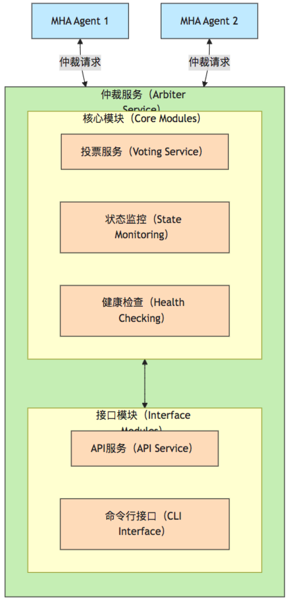
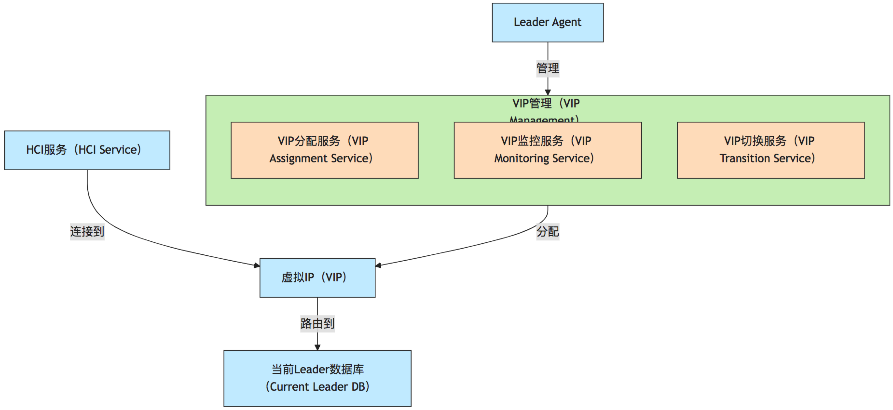
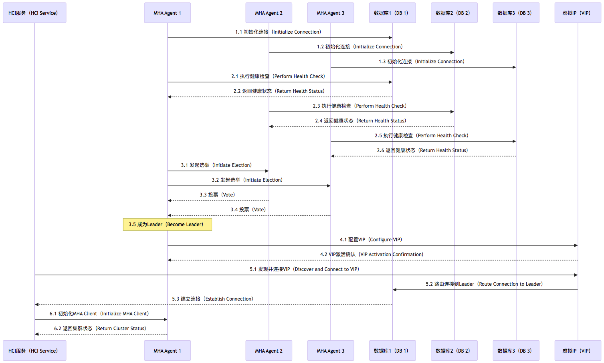
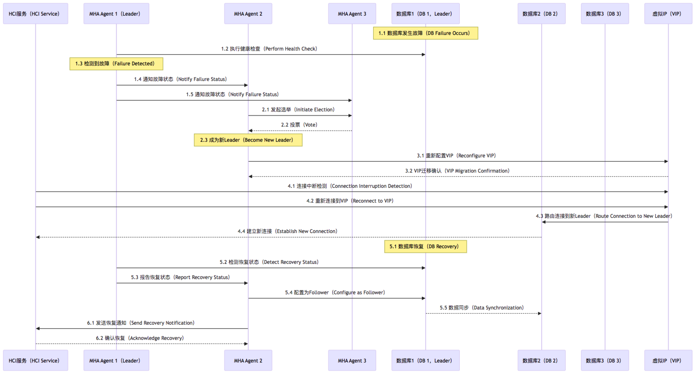
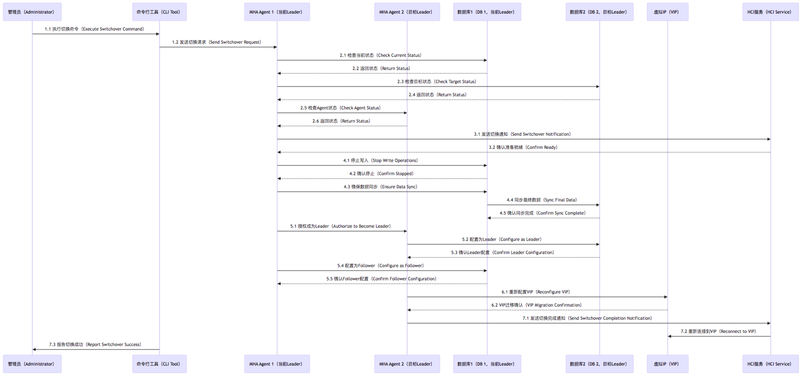

# mha4rdb 项目详细设计文档

## 1. 项目概述

mha4rdb（Master High Availability for Relational Database）是一个基于Go语言的开源项目，旨在为关系型数据库（如MySQL、PostgreSQL、OpenGaussDB和Vastbase等）提供高可用性管理解决方案。该项目借鉴了MySQL MHA、PostgreSQL Patroni等成熟开源项目的设计理念，同时结合了Raft一致性算法，为HCI（超融合基础设施）场景下的数据库集群提供了简单、可靠、自动化的高可用性管理工具。

### 1.1 设计背景与目标

在HCI场景中，配置信息的事务性持久化和一致性至关重要。与通用OLTP数据库相比，HCI场景对数据一致性的要求更高，而对极致读写性能的要求相对较低。mha4rdb项目针对这一特点，设计了从单机部署到多机集群的演进路径，并通过Raft一致性算法保证数据的高可用和一致性。

### 1.2 核心功能

- 支持多种部署模式：单机、双机+仲裁、多机集群
- 基于Raft算法的一致性保证
- 自动故障检测与恢复
- 自动Leader选举与切换
- 虚拟IP（VIP）管理，提供统一访问入口
- 与HCI服务的良好集成
- 全面的监控与告警机制

## 2. 系统架构

mha4rdb采用分层架构设计，将系统分为多个独立但相互协作的组件。这种设计使得系统具有高度的模块化和可扩展性，同时也便于测试和维护。

### 2.1 整体架构图

上图展示了mha4rdb的整体架构。HCI服务通过MHA客户端与MHA集群交互，MHA集群由多个MHA代理和可选的仲裁服务组成。MHA代理负责监控和管理各自的数据库实例，并通过Raft协议实现Leader选举和一致性。虚拟IP（VIP）为HCI服务提供了统一的访问入口，始终指向当前的Leader节点。

### 2.2 部署架构图

根据不同的部署场景，mha4rdb支持多种部署模式：

上图展示了mha4rdb的三种部署模式：
1. 单机部署：简单但存在单点故障的风险
2. 双机+仲裁部署：通过引入仲裁服务避免脑裂问题
3. 多机集群部署：提供更高的可用性和扩展性

### 2.3 分层架构设计

上图展示了mha4rdb的分层架构设计：
1. 接口层：提供API接口和命令行工具，与用户或外部系统交互
2. 应用层：实现业务逻辑，包括集群管理、健康检查、故障转移、恢复和VIP管理等服务
3. 领域层：包含系统的核心领域逻辑，如Raft共识、集群健康、状态管理和Leader选举等
4. 基础设施层：提供底层支持，包括数据库适配器、网络管理、存储、日志和监控指标等

## 3. 核心组件

### 3.1 MHA Agent

MHA Agent是mha4rdb的核心组件，部署在每个数据库节点上，负责监控和管理本地数据库实例，以及参与Raft集群的选举和管理。

MHA Agent的核心模块包括：
1. Raft模块：实现Raft一致性算法，负责Leader选举和日志复制
2. 健康监控模块：监控本地数据库实例的健康状态
3. 状态管理模块：管理Agent和数据库的状态信息
4. 故障转移模块：在故障发生时执行故障转移操作

### 3.2 MHA Client

MHA Client是HCI服务集成的客户端库，提供与MHA集群交互的接口。

MHA Client的核心模块包括：
1. 连接发现：发现并连接到MHA集群，获取Leader节点信息
2. 状态监控：监控MHA集群的状态
3. 事件处理：处理集群状态变化事件，如Leader切换

### 3.3 仲裁服务（Arbiter）

在双机部署场景下，仲裁服务是避免脑裂问题的关键组件。

仲裁服务的核心模块包括：
1. 投票服务：接收并处理Agent的投票请求
2. 状态监控：监控集群的整体状态
3. 健康检查：检查自身和Agent的健康状态

### 3.4 虚拟IP管理

虚拟IP（VIP）是为HCI服务提供统一访问入口的关键组件。

VIP管理的核心模块包括：
1. VIP分配服务：将VIP分配给当前的Leader节点
2. VIP监控服务：监控VIP的状态和可达性
3. VIP切换服务：在Leader切换时迁移VIP

## 4. 核心流程

### 4.1 启动流程

上图展示了mha4rdb的启动流程，包括初始化连接、健康检查、Raft选举、VIP配置、HCI连接和MHA Client初始化等步骤。

### 4.2 故障检测与恢复流程

上图展示了mha4rdb的故障检测与恢复流程，包括故障检测、Raft重新选举、VIP迁移、HCI重新连接和故障恢复等步骤。

### 4.3 手动切换流程

上图展示了mha4rdb的手动切换流程，包括发起手动切换、预检查、准备切换、执行切换、角色切换、VIP迁移和完成切换等步骤。

## 5. 数据流

### 5.1 正常操作数据流
